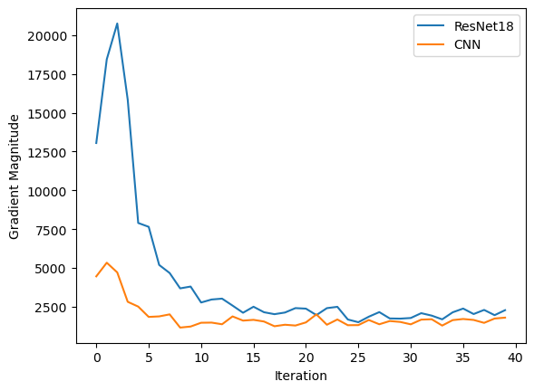

## LABORATORY 1 - Convolutional Neural Networks

## Folder structure

- `Lab1-CNNs.ipynb`: Base Jupyter notebook with the laboratory instructions from the course.
- `Lab1-CNNs Exercise.ipynb`: Jupyter notebook with the exercises completed by the student.
- `wandb`: Folder with the weights and biases files generated during the training of the models.
- `images`: Folder with the images of the results of the exercises.
- `model_states`: Folder with the model states generated during the training of the models.

## 1. Introduction

This laboratory is focused on Convolutional Neural Networks (CNNs). The main goal is to understand the basic concepts of CNNs and how to implement them using the PyTorch library. The laboratory is divided into two parts. In the first part, we have the base file 'Lab1-CNNs.ipynb' with the instructions and the code to be completed by the student. In the second part, we have the file 'Lab1-CNNs Exercise.ipynb' with the exercises to be completed by the student.

## 2. Exercises

We have three different exercises in this laboratory. The first exercise is about implementing a skip connection network (in this case i will use a ResNet18) and a Convolutional Neural Network (CNN) without skip connections. The second exercise is about reimplementation of the Resnet18 model to a Fully Convolutional Network (FCN). The third exercise is about implementing Grad-CAM to visualize the activations of the network on ResNet18.

### 2.1. Exercise 1

I have implemented the ResNet18 (like the paper) and a version of the CNN without skip connections. The ResNet18 model has 18 layers and skip connections. The CNN model has 18 layers but without skip connections. The models were trained using the CIFAR10 dataset. The models were trained for 5 epochs. The models were trained using the Adam optimizer with a learning rate of 0.001. I evaluated skip connections showing the gradients of the models.
We can see that the gradient of the ResNet18 model is much taller than the CNN model. This is because the skip connections help the model to converge faster and better. The accuracy of the ResNet18 model is higher than the CNN model. This is because the skip connections help the model to learn better the features of the images and avoid the vanishing gradient problem.

It's possible to see the accuracy, loss and other metrics of the two models on weights and biases for 20 epochs and loading the model states from the model_states folder.

### 2.2. Exercise 2

I have implemented the ResNet18 model to a Fully Convolutional Network (FCN). The FCN model has the same architecture as the ResNet18 model but without the fully connected layers. The models were trained using the custom MNIST dataset enlarged to 32x32 to fit the ResNet18 model. In this case the ResNet18 model removes the fully connected layers and adds a convolutional layer to the end of the model.

### 2.3. Exercise 3

I have implemented the Grad-CAM algorithm to visualize the activations of the network on ResNet18. I have implemented a Grad-CAM model to visualize the activations of the network on the CIFAR10 dataset. We can see the output of the image with the activations of the network. The Grad-CAM algorithm helps us to understand what the network is looking at when it is making a prediction.

