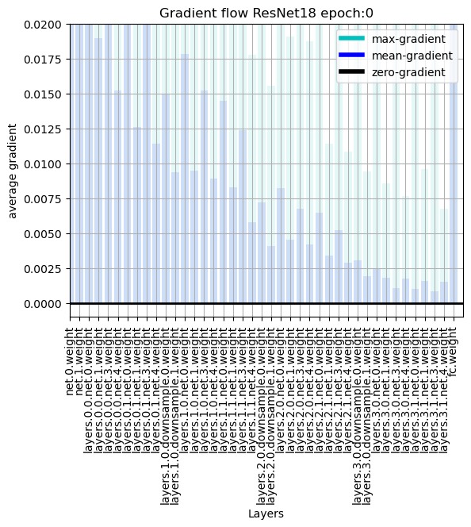
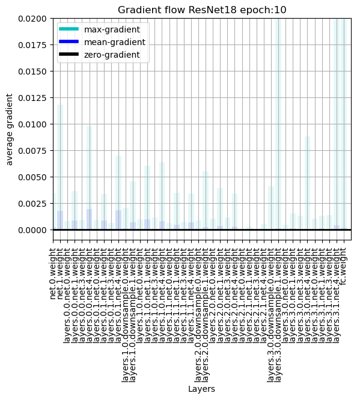
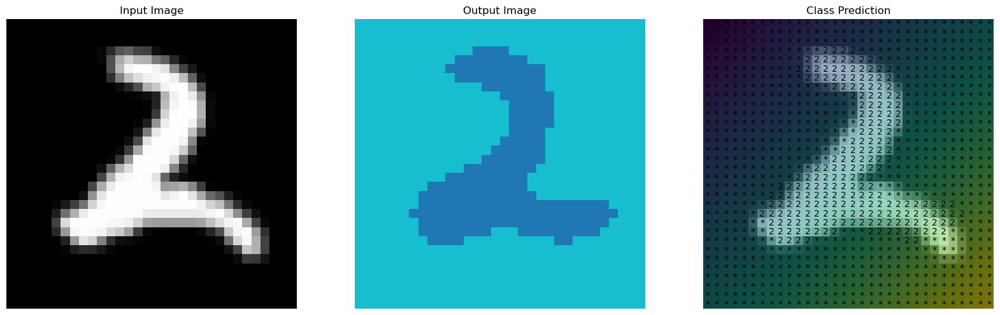

# LABORATORY 1 - Convolutional Neural Networks

## Folder structure

- `Lab1-CNNs.ipynb`: Base Jupyter notebook with the laboratory instructions from the course.
- `Lab1-CNNs-Exercise1.ipynb`: Jupyter notebook with the exercises completed by the student during the laboratory.
- `Lab1-CNNs-Exercise2.ipynb`: Jupyter notebook with the exercises completed by the student for the exam.
- `wandb`: Folder with the weights and biases files generated during the training of the models.
- `images`: Folder with the images of the results of the exercises.
- `model_states`: Folder with the model states generated during the training of the models.

# 1. Introduction

This laboratory is focused on Convolutional Neural Networks (CNNs). The main goal is to understand the basic concepts of CNNs and how to implement them using the PyTorch library. The laboratory is divided into two parts:

In the first part, we have the base file 'Lab1-CNNs.ipynb' with the instructions and the code to be completed by the student during the laboratory session.

In the second part, we have the file 'Lab1-CNNs-Exercise2.ipynb' with the exercises to be completed by the student for the exam.

# 2. Exercises

We have three different exercises in this laboratory:
1. The first exercise is about implementing a CNN model, in this case a ResNet18 model, and visualizing the gradients and the effect of the skip connections on the model.
2. The second exercise is about implementing a Fully Convolutional Network (FCN), in this case using the ResNet18 model.
3. The third exercise is about implementing the Grad-CAM algorithm to visualize the activations of the network.

## 2.1. Exercise 1 [Skip Connections]

I have implemented the ResNet18 model with a parameter to enable or disable the skip connections. 
For this exercise, I have trained the ResNet18 model with and without skip connections on the CIFAR10 dataset.
For every epoch, I have saved the gradients of the model and plotted them to see the effect of the skip connections on the model.

We can see that the model with skip connections has a smoother gradient magnitude than the model without skip connections. This is because the skip connections help the model to learn better and avoid the vanishing gradient problem.

### Results

#### No Skip Connections
 

#### Skip Connections

#### Loss

We can see that the model with skip connections has a smoother gradient magnitude and a lower loss than the model without skip connections.

## 2.2. Exercise 2 [FCN]

### From the paper: https://arxiv.org/abs/1411.4038

For the second exercise, I have implemented a Fully Convolutional Network (FCN) using the ResNet18 model. 

The FCN model is used for image segmentation on the MNIST dataset.
For the ground truth of the image, I convert the image to a binary image, where the number pixel values the label and the background pixel values another class (background label).

For the results of the model, I have plotted the input image, the result of the model, and the comparison between the ground truth and the result of the model.

### Results

## 2.3. Exercise 3 [Grad-CAM]

### From the paper: https://arxiv.org/abs/1610.02391

I have implemented the Grad-CAM algorithm to visualize the activations of the network on ResNet18 on the CIFAR10 dataset. We can see the output of the image with the activations of the network. The Grad-CAM algorithm helps us to understand what the network is looking at when it is making a prediction.

The results are not very clear, this is because the images are very small.

### GradCAM

- Compute the Gradient of the Score with Respect to Feature Maps:

    Let $y^c$ be the score for class c, and let $A^k$ represent the feature maps of the k-th convolutional layer. The gradient of $y^c$ with respect to $A^k$ is given by: $\frac{\partial y^c}{\partial A^k}$

- Average the Gradients to Get Weights:

    To get the weights $\alpha^k_c$ for each feature map, you average the gradients over all spatial locations: $\alpha^k_c = \frac{1}{Z} \sum_{i,j}\frac{\partial y^c}{\partial A^k_{ij}}$ where Z is the number of spatial locations, and $A^k_{ij}$ is the value of the k-th feature map at spatial location (i, j).

- Compute the Heatmap:

    The heatmap is computed by taking a weighted sum of the feature maps in the layer: $L^c_{GradCAM} = ReLU(\sum_k \alpha^k_c A^k)$ where $L^c_{GradCAM}$ is the heatmap for class c.

### Results

