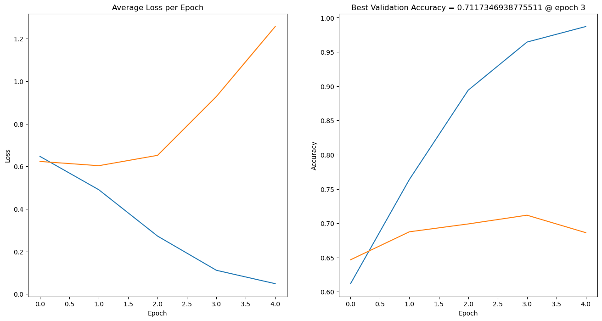
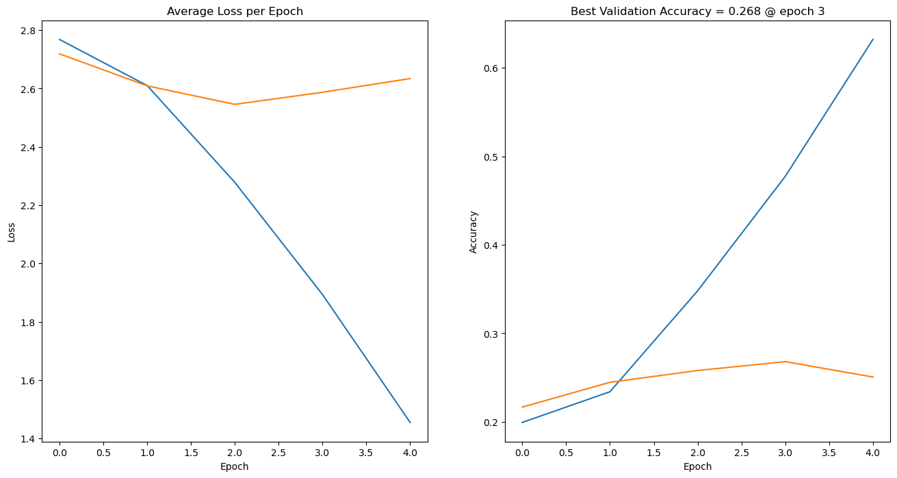
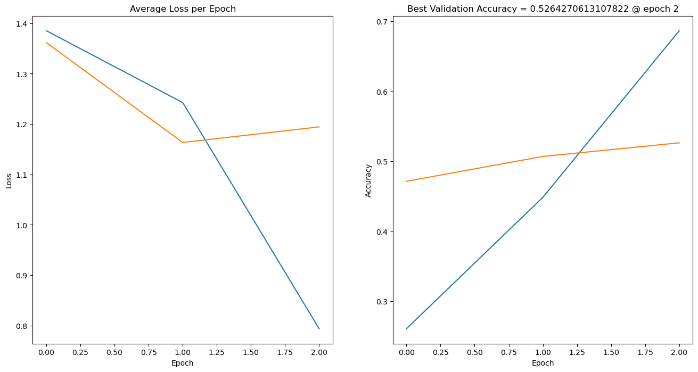

# LABORATORY 2 - LLM

## Folder structure

- `Lab2-LLMs.ipynb`: Base Jupyter notebook with the laboratory instructions from the course.
- `Lab2-LLMs-Exercise3.ipynb`: Jupyter notebook with the exercises completed by the student.
- `wandb`: Folder with the weights and biases files generated during the training of the models.
- `images`: Folder with the images used in the README file.
- `model_states`: Folder with the model states generated during the training of the models.

# 1. Introduction

This laboratory is focused on Language Models (LLMs). The main goal is to understand the basic concepts of LLMs and how to implement them using the PyTorch library. The laboratory is divided into two parts. In the first part, we have the base file 'Lab2-LLMs.ipynb' with the instructions and the code to be completed by the student. In the second part, we have the file 'Lab2-LLMs-Exercise3.ipynb' with the exercises to be completed by the student.

# 2. Exercises

We have three different exercises in this laboratory:
1. The first exercise is a classification task using a BERT model on the Tweet Eval dataset. The goal is to classify the tweets into irony or not irony. I experimented also with a harder task, which is to classify the tweets into all the categories of the dataset, about 20 categories.

2. The second exercise is a Question Answering task using a BERT model on the AI2_ARC dataset. The goal is to answer the questions based on the context of the text. I try also with another dataset, which is the SWAG dataset with the huggingface trainer.

3. The third exercise is a Text Retrieval task using a BERT model.

### BERT model: 


## 2.1. Exercise 1

For the first exercise, I implemented a Classification Neural Network using the DistilBERT model from the Hugging Face Transformers library. The Classification Neural Network is a feature extractor from the DistilBERT model, followed by a fully connected layer to classify the tweets into the number of the classes to be predicted.

The Tweet eval dataset for irony classification and for all the categories classification is loaded using a custom dataset class to preprocess the data and tokenize the tweets using the DistilBERT tokenizer from the Hugging Face Transformers library.

I reduced the size of the emoji dataset for the execution time reasons.

The results are saved on the Weights and Biases platform.

### Tweet_eval dataset: https://huggingface.co/datasets/cardiffnlp/tweet_eval
Example of the dataset emoji:
```
{'label': 12, 'text': 'Sunday afternoon walking through Venice in the sun with @user ️ ️ ️ @ Abbot Kinney, Venice'}
```
Example of the dataset irony:
```
{'label': 1, 'text': 'seeing ppl walking w/ crutches makes me really excited for the next 3 weeks of my life'}
```

### Results 

| Model | Dataset | Accuracy | Goal |
|-------|---------|----------|---|
| DistilBERT | Tweet Eval Irony | 0.71 | 0.73 |
| DistilBERT | Tweet Eval Emoji | 0.26 | 0.32 |

### Irony Classification


### Emoji Classification



## 2.2. Exercise 2

For the second exercise, I implemented a Question Answering Neural Network using the DistilBERT model for Multiple Choice Question Answering.
In this case the dataset is the AI2_ARC dataset, which is preprocessed adding for each question the all the possible answers.
For this task, it is necessary to reimplement a datacollator to handle the multiple choice question answering task.

The results are saved on the Weights and Biases platform.

### AI2_ARC dataset: https://huggingface.co/datasets/ai2_arc
Example of the dataset:
```
{
    "answerKey": "B",
    "choices": {
        "label": ["A", "B", "C", "D"],
        "text": ["Shady areas increased.", "Food sources increased.", "Oxygen levels increased.", "Available water increased."]
    },
    "id": "Mercury_SC_405487",
    "question": "One year, the oak trees in a park began producing more acorns than usual. The next year, the population of chipmunks in the park also increased. Which best explains why there were more chipmunks the next year?"
}
```

### SWAG dataset: https://huggingface.co/datasets/swag
Example of the dataset:
```
{
  "video-id": "anetv_dm5WXFiQZUQ",
  "fold-ind": "18419",
  "startphrase", "He rides the motorcycle down the hall and into the elevator. He",
  "sent1": "He rides the motorcycle down the hall and into the elevator."
  "sent2": "He",
  "gold-source": "gold",
  "ending0": "looks at a mirror in the mirror as he watches someone walk through a door.",
  "ending1": "stops, listening to a cup of coffee with the seated woman, who's standing.",
  "ending2": "exits the building and rides the motorcycle into a casino where he performs several tricks as people watch.",
  "ending3": "pulls the bag out of his pocket and hands it to someone's grandma.",
  "label": 2,
}
```

### Results

| Model | Dataset | Accuracy | 
|-------|---------|----------|
| DistilBERT | AI2_ARC | 0.526 |
| DistilBERT | SWAG | 0.705 |

### Plot AI2_ARC


## 2.3. Exercise 3 [NOT FINISHED]

For the third exercise, it is necessary to implement a Text Retrieval Neural Network using the DistilBERT model. In this case the model is trained to retrieve the most similar text to a given query. For the retrieval task, I use a cosine similarity function to compare the embeddings of the query and the text.
