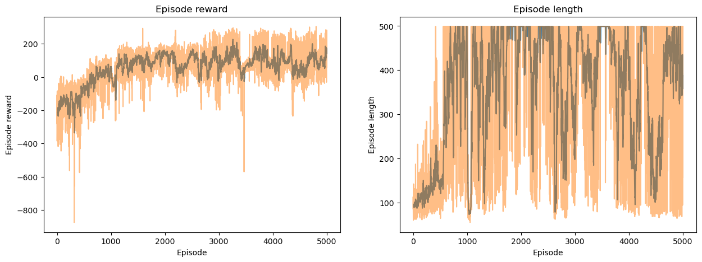

# LABORATORY 2 - DRL

## Folder structure

- `Lab2-DRL.ipynb`: Base Jupyter notebook with the laboratory instructions from the course.
- `Lab2-DRL-Exercise3.ipynb`: Jupyter notebook with the exercises completed by the student.
- `wandb`: Folder with the weights and biases files generated during the training of the models.
- `images`: Folder with the images used in the README file.

# 1. Introduction

This laboratory is focused on Deep Reinforcement Learning (DRL). The main goal is to understand the basic concepts of DRL and how to implement them using the PyTorch library. 

# 2. Exercises

We have three different exercises in this laboratory:

1. For the first exercise it is necessary to implement the REINFORCE algorithm to solve the LunarLander-v2 environment from the OpenAI Gym.

2. For the second exercise it is necessary to implement the DQN algorithm to solve the CartPole-v1 and LunarLander-v2 environments from the OpenAI Gym.

3. For the third exercise it is necessary to implement the PPO algorithm to solve the CarRacing-v0 environment from the OpenAI Gym.

## 2.1. Exercise 1

For the first exercise, I implemented the REINFORCE algorithm to solve the LunarLander-v2 and CartPole-v1 environments from the OpenAI Gym with and without a baseline.

### REINFORCE Algorithm

The REINFORCE algorithm is a policy gradient method that estimates the policy gradient using the likelihood ratio trick. The policy gradient is defined as the gradient of the expected return with respect to the policy parameters.

The REINFORCE algorithm has the following steps and formulas:

1. Initialize the policy parameters randomly: $\theta \sim \pi_{\theta}$.
2. Generate an episode using the current policy: $s_0, a_0, r_1, s_1, a_1, r_2, ..., s_{T-1}, a_{T-1}, r_T$.
3. Compute the return for each time step: $G_t = \sum_{k=0}^{T-t} \gamma^k r_{t+k}$.

The policy gradient is defined as: $\nabla_{\theta} J(\theta) = \mathbb{E}_{\pi_{\theta}}[\nabla_{\theta} \log \pi_{\theta}(s, a) Q^{\pi_{\theta}}(s, a)]$.

The policy update is defined as: $\theta_{t+1} = \theta_t + \alpha \nabla_{\theta} J(\theta)$.

### Results

#### CartPole-v1 [without baseline]

#### CartPole-v1 [with baseline]

#### LunarLander-v2 [without baseline]

#### LunarLander-v2 [with baseline]

## 2.2. Exercise 2

For the second exercise, I implemented the DQN algorithm to solve the CartPole-v1 and LunarLander-v2 environments from the OpenAI Gym.

### DQN Algorithm

The DQN algorithm is a model-free, off-policy algorithm for learning action-value functions. The DQN algorithm uses a replay buffer to store the experiences and a target network to stabilize the learning process.

The DQN algorithm has the following steps and formulas:

1. Initialize the Q-network parameters randomly: $\theta \sim Q_{\theta}$.
2. Initialize the target network parameters: $\theta^{-} \leftarrow \theta$.
3. Initialize the replay buffer: $D = \emptyset$.
4. Generate an episode using the current policy: $s_0, a_0, r_1, s_1, a_1, r_2, ..., s_{T-1}, a_{T-1}, r_T$.
5. Store the transition in the replay buffer: $D \leftarrow D \cup (s_t, a_t, r_{t+1}, s_{t+1})$.
6. Sample a minibatch of transitions from the replay buffer: $B \sim D$.
7. Compute the target value: $y_t = r_{t+1} + \gamma \max_{a'} Q_{\theta^{-}}(s_{t+1}, a')$.
8. Compute the loss: $L(\theta) = \mathbb{E}_{(s, a, r, s') \sim B}[(y_t - Q_{\theta}(s, a))^2]$.
9. Update the Q-network parameters: $\theta \leftarrow \theta - \alpha \nabla_{\theta} L(\theta)$.
10. Update the target network parameters: $\theta^{-} \leftarrow \tau \theta + (1 - \tau) \theta^{-}$.

### Results

#### CartPole-v1

#### LunarLander-v2

## 2.3. Exercise 3

For the third exercise, I implemented the PPO algorithm to solve the CarRacing-v0 environment from the OpenAI Gym.
In this case, the network architecture is a CNN with two convolutional layers, followed by two fully connected layers.

### PPO Algorithm

The PPO algorithm is a policy gradient method that uses a clipped objective function to improve the stability of the learning process. The PPO algorithm has the following steps and formulas:

1. Initialize the policy parameters randomly: $\theta \sim \pi_{\theta}$.
2. Initialize the value function parameters randomly: $\phi \sim V_{\phi}$.
3. Initialize the old policy parameters: $\theta_{\text{old}} \leftarrow \theta$.
4. Initialize the environment: $s_0 \leftarrow \text{env}$.
5. Generate an episode using the current policy: $s_0, a_0, r_1, s_1, a_1, r_2, ..., s_{T-1}, a_{T-1}, r_T$.
6. Compute the return for each time step: $G_t = \sum_{k=0}^{T-t} \gamma^k r_{t+k}$.
7. Compute the advantage function: $A(s, a) = Q^{\pi_{\theta}}(s, a) - V^{\pi_{\phi}}(s)$.
8. Compute the policy gradient: $\nabla_{\theta} J(\theta) = \mathbb{E}_{\pi_{\theta}}[\nabla_{\theta} \log \pi_{\theta}(s, a) A(s, a)]$.
9. Compute the value function loss: $L(\phi) = \mathbb{E}_{\pi_{\theta}}[(V^{\pi_{\phi}}(s) - G_t)^2]$.
10. Compute the policy loss: $L(\theta) = \mathbb{E}_{\pi_{\theta}}[\min(r_t(\theta) A_t, \text{clip}(r_t(\theta), 1 - \epsilon, 1 + \epsilon) A_t)]$.
11. Update the policy parameters: $\theta_{\text{old}} \leftarrow \theta$.
12. Update the value function parameters: $\phi \leftarrow \phi - \alpha \nabla_{\phi} L(\phi)$.
13. Update the policy parameters: $\theta \leftarrow \theta + \alpha \nabla_{\theta} L(\theta)$.

### Results

#### CarRacing-v0

