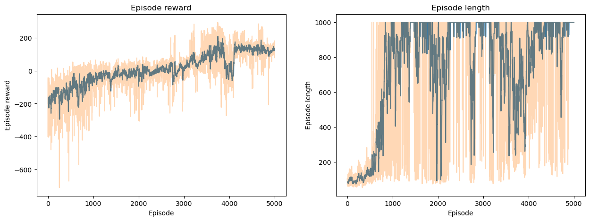

# LABORATORY 3 - DRL

#Video Results: 

## Folder structure

- `Lab3-DRL.ipynb`: Base Jupyter notebook with the laboratory instructions from the course.
- `Lab3-DRL-PARTLY.ipynb`: Jupyter notebook with the exercises completed by the student during the laboratory session.
- `Lab3-DRL-Exercise3.ipynb`: Jupyter notebook with the exercises completed by the student for the exam.
- `wandb`: Folder with the weights and biases files generated during the training of the models.
- `images`: Folder with the images used in the README file.
- `model_states`: Folder with the model states generated during the training of the models.
  
# 1. Introduction

This laboratory is focused on Deep Reinforcement Learning (DRL). The main goal is to understand the basic concepts of DRL and how to implement them using the PyTorch library. 

# 2. Exercises

We have three different exercises in this laboratory:

1. For the first exercise it is necessary to implement the REINFORCE algorithm to solve the LunarLander-v2 environment from the OpenAI Gym.

2. For the second exercise it is necessary to implement the DQN algorithm to solve the CartPole-v1 and LunarLander-v2 environments from the OpenAI Gym.

3. For the third exercise it is necessary to implement the PPO algorithm to solve the CarRacing-v0 environment from the OpenAI Gym.

## 2.1. Exercise 1

For the first exercise, I implemented the REINFORCE algorithm to solve the LunarLander-v2 and CartPole-v1 environments from the OpenAI Gym with and without a baseline.

### REINFORCE Algorithm

The REINFORCE algorithm is a policy gradient method that estimates the policy gradient using the likelihood ratio trick. The policy gradient is defined as the gradient of the expected return with respect to the policy parameters.

### Results

#### CartPole-v1 [without baseline]

#### LunarLander-v2 [without baseline]

#### CartPole-v1 [with baseline]

#### LunarLander-v2 [with baseline]

We can see that the REINFORCE algorithm with a baseline has a better performance than the REINFORCE algorithm without a baseline. 

The REINFORCE algorithm, with and without a baseline, is not able to solve the LunarLander-v2 environment, reaching a maximum score of around 170 points for the REINFORCE algorithm with a baseline.

## 2.2. Exercise 2

For the second exercise, I implemented the DQN algorithm to solve the CartPole-v1 and LunarLander-v2 environments from the OpenAI Gym.

### DQN Algorithm

The DQN algorithm is a model-free, off-policy algorithm for learning action-value functions. The DQN algorithm uses a replay buffer to store the experiences and a target network to stabilize the learning process.

### Results

#### CartPole-v1

#### LunarLander-v2

In this case, the DQN algorithm was able to solve the LunarLander-v2 environments. The DQN algorithm was able to achieve a good performance in both environments after few episodes of training respect to the REINFORCE algorithm.

## 2.3. Exercise 3 

For the third exercise, I implemented the PPO algorithm to solve the CarRacing-v0 environment from the OpenAI Gym.
In this case, the network architecture is a CNN with two convolutional layers and two fully connected layers.

### PPO Algorithm

The PPO algorithm is a policy gradient method that uses a clipped objective function to improve the stability of the learning process. 

### Results

#### CarRacing-v0

